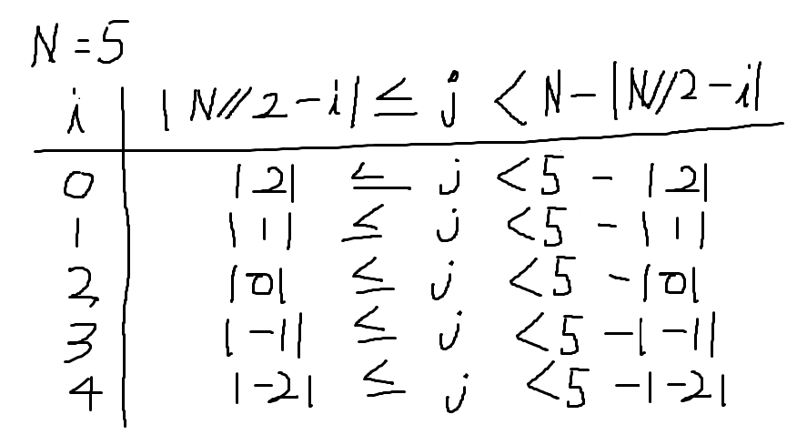

## 농작물 수확하기(#2805)

```python
import sys
sys.stdin = open('input.txt', 'r')

def abs_val(n):
    if n < 0:
        return -n
    return n

T = int(input())
for tc in range(1, T + 1):
    N = int(input())
    farm = [input() for _ in range(N)]
    result = 0

    for i in range(N):
        for j in range(N):
            if j >= abs_val(N//2 - i) and j < N - abs_val(N//2 - i):
                result += int(farm[i][j])

    print("#{} {}".format(tc, result))
```

---

제한 조건이 무조건 홀수라는 것을 이용했다.

총 길이를 반으로 나눈 몫은 반드시 가운데이다. 인덱스 0부터 시작한다고 했을 때, 행을 기준으로 결과값에 더해야할 부분이 가운데 행까지 늘었다가 다시 동일한 양만큼 줄어든다.

범위는 다음과 같다



문제에 나온 것과 똑같은 범위로 열의 범위를 제한할 수 있다.


이런 수학적?이라고 할 수 있는 풀이 말고 다른 방법도 생각해볼 필요가 있다.
