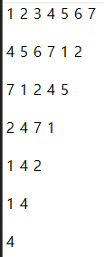

## b1158

```python
class numbers():
    def __init__(self, N):
        self.numbers = [i for i in range(1, N+1)]

    def push(self, n):
        self.numbers += [n]

    def pop(self, index):
        tmp = self.numbers[index]
        self.numbers = self.numbers[:index] + self.numbers[index+1:]
        return tmp

li = numbers(N)
result = ''
for i in range(N):
    for j in range(K-1):
        tmp = li.pop(0)
        li.push(tmp)
    result += str(li.pop(0)) + ', '

print("<{}>".format(result[:-2]))
```

처음에는 클래스로 ``push``와 ``pop``을 만들어서 구현했다. 코드는 잘 돌아갔지만, 시간 초과 문제가 계속해서 발생했다. 큐를 이용한 구현은 좋았지만, 불필요한 부분이 많았던 것 같다.



요세푸스 순열은 위의 사진처럼 변하는데 3번째 인덱스에 해당하는 것만 추출하면 된다. 시간 초과 문제를 해결하기 위해서 클래스로 하지 않고 리스트를 용했다.

```python
import sys
N, K = map(int, sys.stdin.readline().split())
numbers = [i for i in range(1, N+1)]
result = ''

idx = 0
while numbers:
    idx += K - 1
    idx %= N
    result += str(numbers[idx]) + ', '
    numbers = numbers[:idx] + numbers[idx+1:]
    N -= 1
print("<{}>".format(result[:-2]))
```

루프를 돌 때마다 현재 ``index``값을 옮겨줘야 하고, 리스트의 범위를 넘어섰을 때 다시 앞에서부터 순회하도록 만들어야 했다.