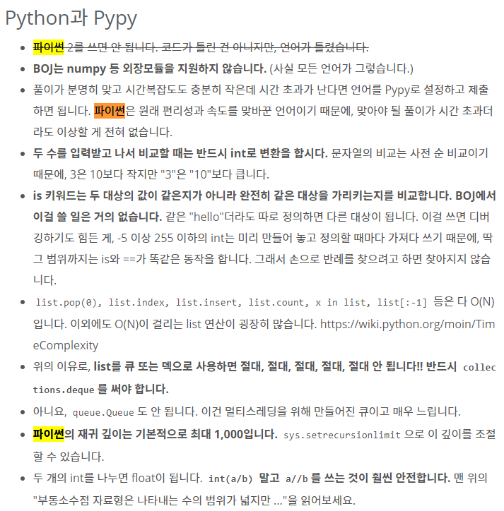
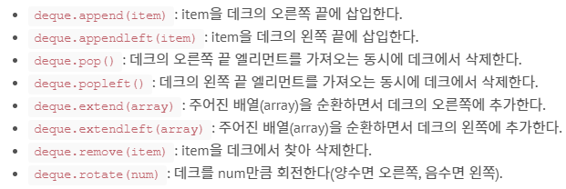

## b2164

```python
import sys
import collections
N = int(sys.stdin.readline())
numbers = collections.deque(i for i in range(N, 0, -1))

while len(numbers) > 1:
    numbers.pop()
    numbers.rotate(1)
print(numbers[-1])
```
---



list를 이용해서 풀려고 했더니 시간초과 때문에 한참 고생했다.

``deque``를 사용해서 해결했다. 일반적인 리스트는 양 끝단에 요소를 삽입, 제거할 경우 O(n) 시간이 걸리지만 ``deque``는 O(1) 시간이 걸린다. 결과적으로 실행 시간을 축소할 수 있다.



